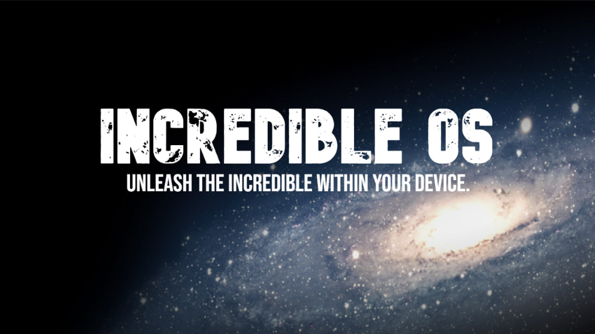
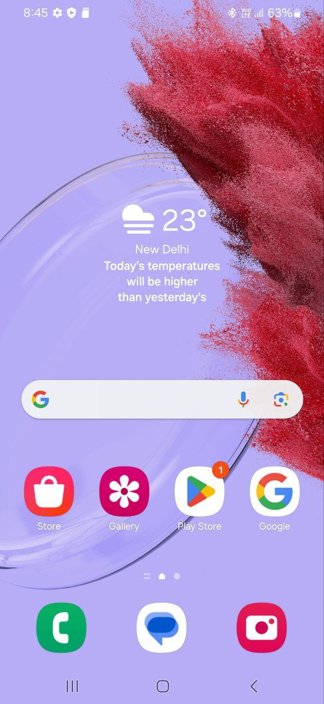
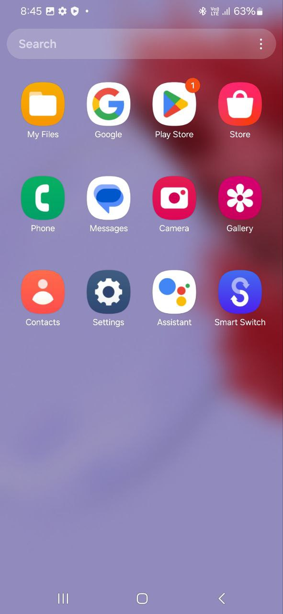
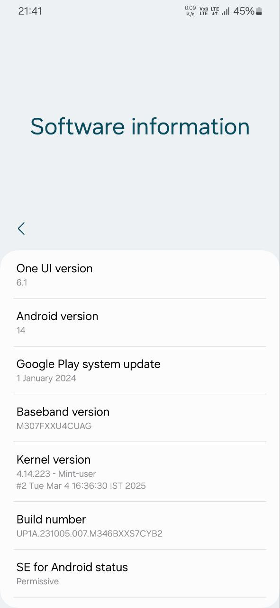
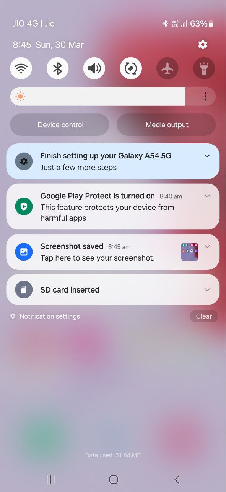
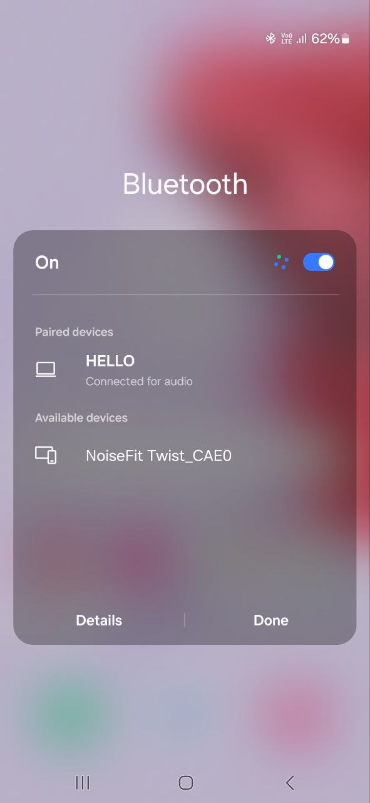
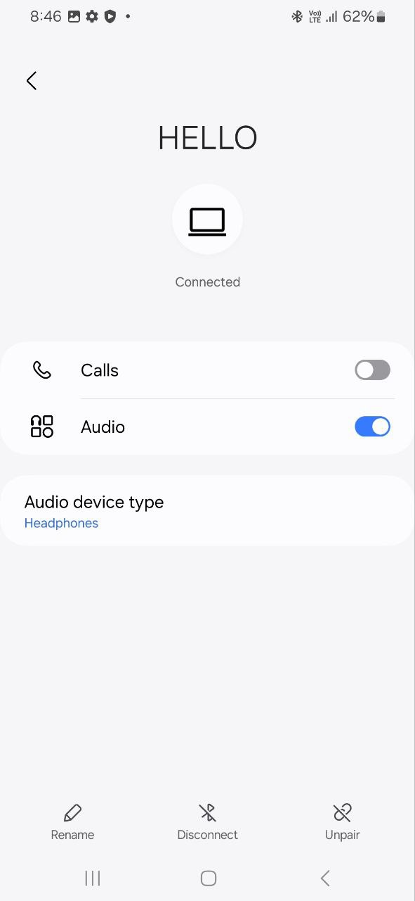
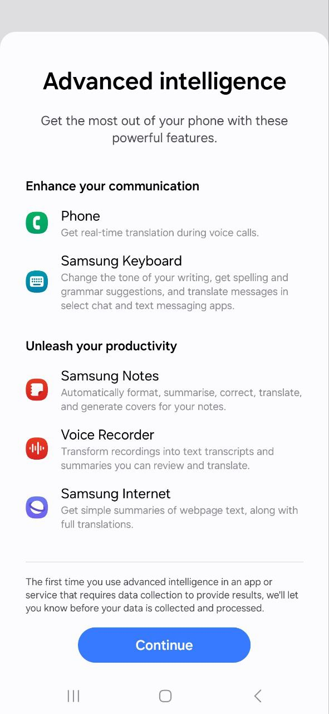
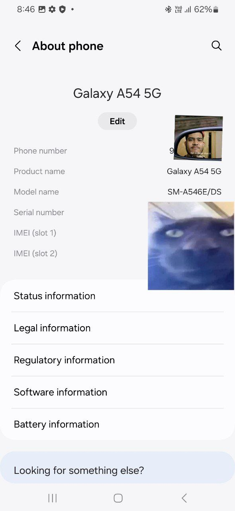

# Incredible OS - Android 14 (One UI 6.1) for Samsung Galaxy M30S

  

## Overview

Samsung may have stopped updates for the Galaxy M30S, but **Incredible OS** keeps it alive and better than ever! Experience the latest **One UI 6.1** based on **Android 14** with a host of enhancements designed to make your device feel brand new.

✨ **Incredible OS x DisturbedUI** ✨  
📱 **Samsung Galaxy M30S**

📱 Device Information​

Device: Samsung Galaxy M30S (SM-M307F)
ROM Version: Incredible OS (One UI 6.1)
Android Version: 14
Base Firmware: Galaxy M34
Developer:@Dhiren9611
---

## 📦 Download
IncredibleOS is now available for download! [Click Here](https://xdaforums.com/t/rom-14-one-ui-6-1-stable-incredible-os-v3-for-galaxy-m30s.4728388/) (Don't forget to hit the Thanks button on XDA!)

---

## 🌟 Features & Enhancements
- **One UI 6.1 Experience** – Enjoy a fully functional, smooth, and modern UI.
- **Ported from Galaxy M34** – Seamless integration for better compatibility.
- **All essential One UI 6.1 features** – The latest refinements and features from Samsung.
- **Galaxy AI Features in Keyboard, Samsung Notes and in Broweser Apps**
- **Enhanced Performance & Battery Life** – Optimized system resources for better efficiency.
- **Updated UI Animations & Transitions** – Smoother, faster, and more responsive.
- **Lock Screen Customization** – Modify clock styles, notification layouts, and shortcuts.
- **Stacked Widgets on Home Screen** – Organize widgets for a cleaner home screen experience.
- **Improved RAM Management** – Optimized memory allocation for smoother multitasking.
- **Per-App Language Settings** – Set different languages for different apps.
- **Improved Samsung Keyboard** – Better auto-correct, emojis, and clipboard functions.
- **Photo Remaster & Enhanced Gallery Features** – AI-powered photo enhancements built-in.
- **Enhanced Privacy Controls** – More granular permissions and security improvements.
- **New Quick Settings UI** – Redesigned for better usability.
- **Mint Kernel for Performance** – Improved speed, stability, and efficiency.
- **Debloated but Balanced** – Removed unnecessary system apps while keeping essential functionality.
- **Battery Protection Toggle in QS Panel** – Extend battery lifespan with a single tap.
- **Updated Samsung System Apps** – Enjoy the latest Samsung applications.
- **Call Recording Enabled for Most Regions** – Record calls without regional restrictions.
- **Enabled Many Useful CSC Tweaks** – Additional system optimizations and features.
- **Circle to Search** – Enhanced searching capabilities.
- **ERoFS for Product & Vendor Partitions** – Improved read performance and security.
- **Spoofed as Galaxy A54** – Enjoy features exclusive to Galaxy A54.

---

## 🐞 Known Issues
- **None reported so far.** 🚀 If you find any, let me know with proper logs!

---

## 📱 Device Compatibility
- **Supported Device:** Samsung Galaxy M30S (**SM-M307F**)
- **Base Vendor:** Samsung Galaxy M34 (**VNDK32**)
- **Stock Vendor:** Samsung Galaxy M30S (**VNDK30**)

---

## 📓 Flashing Guide
👨🏻‍💻 **XDA Thread:** [Click Here](https://xdaforums.com/t/rom-14-one-ui-6-1-stable-incredible-os-v3-for-galaxy-m30s.4728388/)  
📽 **Screenshots:** [Click here for Some Spoilers](https://t.me/incredibleOSChat/1973)
<table>
  <tr>
    <td></td>
    <td></td>
    <td></td>
    <td></td>
  </tr>
  <tr>
    <td></td>
    <td></td>
    <td></td>
    <td></td>
  </tr>
</table>

### Prerequisites
- **Unlocked Bootloader Required** – Make sure your bootloader is unlocked.
- **Custom Recovery Required** – Install TWRP or OrangeFox.
- **Backup Your Data** – Prevent data loss by backing up important files.

### Installation Steps
1. **Download the ROM** (once available).
2. **Reboot into recovery mode** (TWRP/OrangeFox).
3. **Wipe Dalvik, Cache, Data, Product, System, and Vendor partitions.**
4. **Ignore the Mounting errors after installation!!**
5. **Flash the Incredible OS ZIP file.**
6. **Reboot & enjoy One UI 6.1 on your M30S!**

---

## 🏆 Credits
- **@Dhiren9611 (Me!)** for porting One UI 6.1 to the M30S and keeping this device alive.
- **@TenSeventy7** for Fresh Services and Mint Kernel.
- **@sundram21** for Mint Kernel for M30S.
- **disturb33d** for the Base, Thanks!!

---

## 📢 Community & Support
📢 **Update Channel:** [incredibleOSUpdates](https://t.me/incredibleOSUpdates)  
💬 **Support Group:** [incredibleOSChat](https://t.me/incredibleOSChat)  
💬 **DisturbedUI Support Group:** [DisturbedUI](https://t.me/disturbedui)  

---

🚀 **Experience the future of the M30S with Incredible OS – because great devices deserve great software!** 🚀
